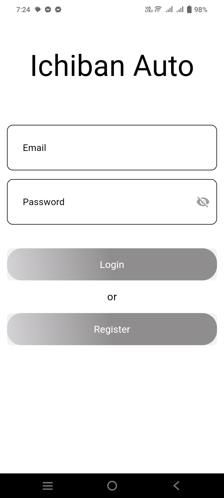

Car Workshop Management System for Ihiban Auto

A comprehensive car workshop management system with a Django REST API backend and Flutter mobile application frontend. The system allows users to schedule car maintenance appointments, mechanics to manage bookings, and administrators to oversee all operations.

## Project Structure

```
car-workshop-system/
├── Backend/
│   └── car_workshop_api/
└── Frontend/
    └── car_workshop_app/
```

-------------------------------------------------------------------------------------

## Backend Setup

1. Clone the repository:
```bash
git clone [repository-url]
cd car-workshop-system/Backend
```

2. Create and activate virtual environment:
```bash
# Windows
python -m venv venv
venv\Scripts\activate

# Linux/MacOS
python3 -m venv venv
source venv/bin/activate
```

3. Install dependencies:
```bash
pip install -r requirements.txt
```

4. Navigate to the Django project:
```bash
cd car_workshop_api
```

5. Run the development server:
```bash
python manage.py runserver
```

The backend server will start at `http://localhost:8000`

-------------------------------------------------------------------------------------

## Frontend Setup

1. Navigate to the Flutter project:
```bash
cd Frontend/car_workshop_app
```

2. Clean the project and get dependencies:
```bash
flutter clean
flutter pub get
```

3. Run the application:
```bash
flutter run
```

-------------------------------------------------------------------------------------


## Production Deployment

The backend is deployed on PythonAnywhere. The Android APK in the repository/email is configured to use the production URL.

- Production API Swagger Documentation: `https://esthieuk.pythonanywhere.com/api/`
- Django Admin Panel: `https://esthieuk.pythonanywhere.com/admin/`


-------------------------------------------------------------------------------------


## Test Credentials

### Admin
- Email: admin@admin.com
- Password: admin1234

### Mechanic
- Email: mechanic@ichiban.com
- Password: mechanic1234

### User
- Email: user@ichiban.com
- Password: user1234


-------------------------------------------------------------------------------------


## User Registration and Role Management

1. New users can register through the mobile app (creates a default user account)
2. To modify user roles:
   - Login to the admin panel at `https://esthieuk.pythonanywhere.com/admin/` using admin credentials
   - Navigate to Users section
   - Select the user you want to modify
   - In the user details, go to the "Groups" section
   - Add the user to either "mechanic" or "admin" group
   - Save changes


-------------------------------------------------------------------------------------


## User Role Capabilities

### Admin
- View all bookings with complete details
- Assign mechanics to bookings
- Update booking status
- View bookings in different status tabs
- Access calendar view of bookings

### Mechanic
- View all bookings and booking details
- Update booking status
- Access calendar view of bookings

### User
- Create and schedule bookings
- View personal booking list
- Track booking status
- Access calendar view of bookings

## Screenshots

### 1. Splash Screen


### 2. Login Page


### 3. Register Page


### 4. User Dashboard


### 5. Profile Page


### 6. Booking Process
#### Step 1: Booking Page 1


#### Step 2: Booking Page 2


#### Step 3: Booking Confirmation


### 7. Admin Dashboard


### 8. Calendar View for Bookings


### 8. Booking List View for Bookings


## Support
For any queries or support, please open an issue in the repository.